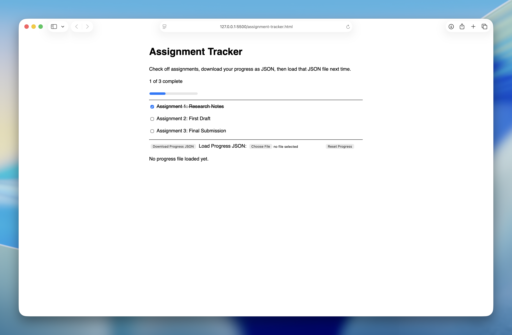
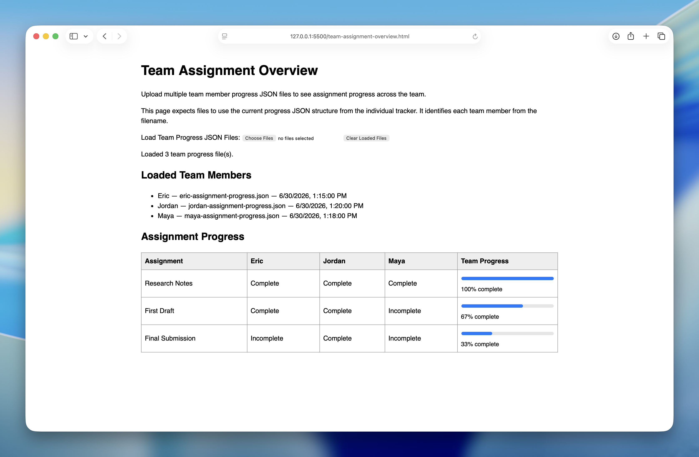

# Assignment Progress Tracker

A local HTML proof of concept for tracking individual assignment progress and viewing team progress from shared JSON files.

The project includes two HTML pages:

- **`assignment-tracker.html`** - Used by individual team members to check off assignments and download their progress as a JSON file
- **`team-assignment-overview.html`** - Used by a manager or team lead to upload multiple progress JSON files and view team progress at a glance

The project runs directly in the browser and does not require a web server, database, login system, hosted app, framework, or external dependency.

The main idea is:

```text
team member checks boxes → downloads JSON → shares JSON → manager uploads multiple JSON files → team progress is displayed
```

## Table of Contents

- [Screenshots](#screenshots)
- [Getting Started](#getting-started)
  - [Track Individual Progress](#track-individual-progress)
  - [View Team Progress](#view-team-progress)
- [Project Workflow](#project-workflow)
- [Pages](#pages)
  - [`assignment-tracker.html`](#assignment-trackerhtml)
  - [`team-assignment-overview.html`](#team-assignment-overviewhtml)
- [Progress File Naming](#progress-file-naming)
- [Current JSON Format](#current-json-format)
- [Progress JSON Breakdown](#progress-json-breakdown)
- [Assignment ID Rules](#assignment-id-rules)
- [How Assignments Should Be Added](#how-assignments-should-be-added)
- [Expected Assignment Format](#expected-assignment-format)
- [How Assignment Names Are Displayed in the Team Overview](#how-assignment-names-are-displayed-in-the-team-overview)
- [Prompt Files](#prompt-files)
  - [Using the Prompt Files with an LLM](#using-the-prompt-files-with-an-llm)
  - [`create-html-from-data.md`](#create-html-from-datamd)
  - [`reuse-save-load-logic.md`](#reuse-save-load-logicmd)
- [Project Structure](#project-structure)
- [Features](#features)
- [Technical Notes](#technical-notes)
- [Current Limitations](#current-limitations)
- [Possible Future Improvements](#possible-future-improvements)
- [Main Takeaway](#main-takeaway)

## Screenshots

### Individual Assignment Tracker



*Basic tracker page with assignment checkboxes, progress display, JSON export, and JSON import controls.*

### Team Assignment Overview



*Manager overview page with multiple uploaded JSON files, team member columns, and progress bars for each assignment.*

## Getting Started

### Track Individual Progress

Use this workflow when a team member wants to update and save their own progress.

1. **Open the tracker**:
   - Open `assignment-tracker.html` in a web browser
   - This should work by double clicking the `.html` file

2. **Update assignment progress**:
   - Check off each assignment as it is completed
   - The progress count and progress bar will update automatically

3. **Save progress**:
   - Click `Download Progress JSON`
   - The browser will download a file named `assignment-progress.json`

4. **Rename the progress file**:
   - Rename the downloaded file so the team member’s name comes before the first hyphen

   Example:

   ```text
   eric-assignment-progress.json
   ```

5. **Share the progress file**:
   - Upload the renamed JSON file to a shared folder
   - Or send it through whatever file-sharing method the team is using

### View Team Progress

Use this workflow when a manager or team lead wants to view progress across multiple team members.

1. **Open the team overview page**:
   - Open `team-assignment-overview.html` in a web browser

2. **Load team progress files**:
   - Click `Load Team Progress JSON Files`
   - Select multiple team member `.json` files at once

3. **Review team progress**:
   - Each team member appears as a column
   - Each assignment appears as a row
   - The Team Progress column shows a progress bar and percentage for each assignment

4. **Clear loaded files when finished**:
   - Click `Clear Loaded Files` to reset the page

## Project Workflow

The full workflow looks like this:

1. Someone prepares `assignment-tracker.html` with the correct assignment list
2. The tracker is shared with the team
3. Each team member opens `assignment-tracker.html`
4. Each team member checks off completed assignments
5. Each team member downloads their progress JSON file
6. Each team member renames their JSON file using the naming convention
7. The JSON files are shared with the manager or uploaded to a shared folder
8. The manager opens `team-assignment-overview.html`
9. The manager uploads multiple JSON files at once
10. The manager reviews the team overview table

## Pages

### `assignment-tracker.html`

`assignment-tracker.html` is the individual tracker.

It is used by one person at a time.

It allows a user to:

- View the assignment list
- Check off completed assignments
- See individual progress
- Download progress as a JSON file
- Load a previous JSON file to restore progress
- Reset the current page state

This page exports the JSON files that the manager overview page can later read.

### `team-assignment-overview.html`

`team-assignment-overview.html` is the manager/team overview page.

It is used to view multiple team member progress files together.

It allows a manager or team lead to:

- Upload multiple JSON files at once
- See each team member as a column
- See each assignment as a row
- View whether each person completed each assignment
- See a progress bar for each assignment across the team

This page does not edit team member progress files.

It only reads uploaded JSON files and displays them together.

## Progress File Naming

The current JSON format does not include a user name.

Because of that, `team-assignment-overview.html` uses the filename to identify each team member.

The name should come before the first hyphen:

```text
eric-assignment-progress.json
maya-assignment-progress.json
jordan-assignment-progress.json
```

These will display as:

```text
Eric
Maya
Jordan
```

This keeps the JSON structure simple and avoids requiring the individual tracker to add a `userName` field.

The main limitation is that names with hyphens will be shortened.

For example:

```text
mary-jane-assignment-progress.json
```

would display as:

```text
Mary
```

## Current JSON Format

Both HTML pages use the same JSON structure.

The individual tracker exports this format.

The team overview page reads multiple files in this format.

Example:

```json
{
  "savedAt": "2026-06-30T20:15:00.000Z",
  "assignments": [
    {
      "id": "assignment-1",
      "completed": true
    },
    {
      "id": "assignment-2",
      "completed": false
    },
    {
      "id": "assignment-3",
      "completed": false
    }
  ]
}
```

## Progress JSON Breakdown

1. **`savedAt`**: The date and time when the progress file was downloaded
2. **`assignments`**: The list of assignments being tracked
3. **`id`**: The assignment ID used to match progress back to the correct checkbox
4. **`completed`**: Whether the assignment checkbox was checked when the file was saved

The `id` field is what connects a saved JSON entry to the correct assignment in both pages.

For example:

```json
{
  "id": "assignment-2",
  "completed": true
}
```

matches this checkbox in `assignment-tracker.html`:

```html
<input type="checkbox" id="assignment-2" data-assignment-id="assignment-2" />
```

It also matches this entry in the team overview assignment title map:

```javascript
const assignmentTitles = {
  "assignment-2": "First Draft"
};
```

## Assignment ID Rules

Assignment IDs are important because they connect the HTML page to the saved JSON files.

The IDs should be:

- Unique
- Lowercase when possible
- Written without spaces
- Kept the same after the tracker is shared
- Not reused for a different assignment later

Simple numbered IDs are fine:

```text
assignment-1
assignment-2
assignment-3
```

If the assignment names change later but the IDs stay the same, older JSON files can still load correctly.

If the IDs change, older JSON files may not match the right assignments anymore.

## How Assignments Should Be Added

The current version does not include a user-facing form for adding assignments.

That means a normal user is not expected to open the tracker and add assignments directly from the browser.

Assignments should be added by updating the HTML file before the tracker is shared with the team.

For example, if the team already has assignments in an Excel sheet, CSV file, copied table, or project planning document, that data can be converted into the checkbox HTML format shown below.

The user-facing workflow stays simple:

1. Someone prepares the HTML tracker with the correct assignments
2. The finished `assignment-tracker.html` file is shared with the team
3. Team members only check boxes, save progress, and load progress files
4. The manager later loads multiple team member JSON files in `team-assignment-overview.html`

## Expected Assignment Format

Each assignment in `assignment-tracker.html` should use this HTML pattern:

```html
<div class="assignment">
  <input type="checkbox" id="assignment-1" data-assignment-id="assignment-1" />
  <label for="assignment-1">Assignment 1: Research Notes</label>
</div>
```

Each assignment needs three matching values:

```html
id="assignment-1"
data-assignment-id="assignment-1"
label for="assignment-1"
```

The visible assignment name goes inside the `<label>` element.

For example:

```html
<label for="assignment-1">Assignment 1: Research Notes</label>
```

## How Assignment Names Are Displayed in the Team Overview

The current JSON format stores assignment IDs, but it does not store readable assignment titles.

To keep the JSON structure unchanged, `team-assignment-overview.html` includes an assignment title map.

Example:

```javascript
const assignmentTitles = {
  "assignment-1": "Research Notes",
  "assignment-2": "First Draft",
  "assignment-3": "Final Submission"
};
```

The `id` is used for matching progress across files.

The title map is used only to display readable assignment names in the manager table.

If an assignment ID is not found in the title map, the page displays the assignment ID itself.

## Prompt Files

The `prompts/` folder contains optional prompt files for using this project with an internal AI assistant.

These prompts are not required to use the tracker. They are included as helper documents for adapting the proof of concept to other situations.

### Using the Prompt Files with an LLM

The files in the `prompts/` folder are meant to be used as task instructions for an LLM.

When using one of these prompts, provide:

1. `README.md`
2. One prompt file from the `prompts/` folder
3. Any source data or existing tracker files needed for the task

*Use only one prompt file at a time.*

A simple way to think about it is:

```text
README.md = project reference
prompt .md file = active task instruction
source data or existing files = material to work on
```

When giving the files to an LLM, include a short instruction like this:

```text
Use the prompt file as the active task instruction.
Use README.md only as project reference.
Do not treat the README's Prompt Files section as a separate task.
```

This helps prevent the LLM from confusing the README's explanation of the prompts with the actual prompt it should follow.

For creating or updating a tracker from source data, provide:

```text
README.md
prompts/create-html-from-data.md
source data, such as a CSV, Excel sheet, copied table, checklist, or planning document
```

For reusing this project's logic in another tracker, provide:

```text
README.md
prompts/reuse-save-load-logic.md
the existing tracker files you want to modify
```


### `create-html-from-data.md`

Use this prompt when starting with assignment data from an Excel sheet, CSV file, copied table, checklist, or planning document.

The prompt tells an internal AI assistant how to create or update `assignment-tracker.html` from that source data.

If `team-assignment-overview.html` is also part of the project, the prompt tells the assistant to update the `assignmentTitles` list inside that file. This keeps the manager overview page matched to the same assignment IDs used by `assignment-tracker.html`, so IDs like `assignment-1` display as readable names like `Research Notes`.

The prompt keeps the current JSON structure unchanged:

```text
savedAt
assignments
assignments[].id
assignments[].completed
```

It should not add fields such as `userName`, assignment titles, due dates, notes, or owners to the JSON unless specifically requested.

### `reuse-save-load-logic.md`

Use this prompt when another tracker already exists and the goal is to reuse part of this project's local HTML/JSON behavior.

The prompt now distinguishes between two workflows:

1. **Individual progress tracking** from `assignment-tracker.html`
2. **Manager/team overview** from `team-assignment-overview.html`

The assistant is instructed to identify which workflow is being requested and avoid combining both unless specifically asked.

Use this prompt when you want an internal AI assistant to add one of these behaviors to another existing tracker:

- Checkbox progress tracking
- JSON export
- JSON import
- Multiple JSON uploads
- Filename-based team member names
- Team progress table
- Progress bars for team completion

The manager overview logic still expects the current JSON structure exported by `assignment-tracker.html`.

Team member names are derived from the first part of the filename before the first hyphen:

```text
eric-assignment-progress.json → Eric
maya-assignment-progress.json → Maya
jordan-assignment-progress.json → Jordan
```

Readable assignment names in the manager overview come from the `assignmentTitles` map inside `team-assignment-overview.html`, not from the JSON files.

The included `assignment-tracker.html` file should be treated as the visual working example for the individual tracker. The included `team-assignment-overview.html` file should be treated as the visual working example for the manager/team overview.

## Project Structure

```text
local-assignment-tracker/
├── assignment-tracker.html
├── team-assignment-overview.html
├── examples/
│   ├── eric-assignment-progress.json
│   ├── maya-assignment-progress.json
│   └── jordan-assignment-progress.json
├── LICENSE.md
├── prompts/
│   ├── create-html-from-data.md
│   └── reuse-save-load-logic.md
├── README.md
└── screenshots/
    ├── assignment-tracker.png
    └── team-assignment-overview.png
```

## Features

- **Local Only**: Runs entirely in the browser from plain `.html` files
- **No Server Required**: Does not need hosting, accounts, or a backend database
- **Individual Tracking**: Team members can track their own assignment progress
- **JSON Export**: Individual progress can be downloaded as a `.json` file
- **JSON Import**: Individual progress can be restored by loading a previous `.json` file
- **Team Overview**: A manager can upload multiple JSON files and view team progress together
- **Progress Bars**: The team overview page shows progress bars for each assignment
- **Manual Team Sharing**: Team members can share progress by uploading their JSON files to a shared location
- **Minimal Styling**: Keeps the pages simple because this is mainly a proof of concept

## Technical Notes

- **No server required**: Both pages run from local HTML files
- **File downloads**: Individual progress is saved by generating a JSON file in the browser
- **File uploads**: Saved progress is restored using the browser’s FileReader API
- **Multiple file uploads**: The manager overview page uses a file input with the `multiple` attribute
- **No automatic syncing**: Progress files must be shared manually
- **Single-file prototypes**: HTML, CSS, and JavaScript are currently kept together inside each HTML file
- **Modern browser recommended**: The pages use standard browser features such as `Blob`, `URL.createObjectURL`, `FileReader`, and `<progress>`

## Current Limitations

- Progress is not automatically synced
- Team members must manually download and share JSON files
- The manager must manually upload multiple JSON files
- The team overview page does not save the combined overview
- There is no user-facing form for adding assignments
- There are no user accounts or permissions
- The team overview page depends on a filename convention to identify team members
- Names with hyphens are not handled well
- Assignment titles are maintained in the manager HTML file, not in the JSON files
- Updating the assignment list currently requires editing or regenerating the HTML file

## Possible Future Improvements

- Add a user-facing assignment creation form
- Add a combined team summary export
- Add warnings when team member files have mismatched assignment IDs
- Add a filter for complete or incomplete assignments
- Add last-updated warnings for old JSON files
- Add support for notes or comments
- Add a way to compare expected team members against uploaded files
- Add an optional `userName` field to the exported JSON later
- Add assignment titles directly to the JSON later
- Split the project into separate HTML, CSS, and JavaScript files
- Build an optional hosted version later if automatic syncing becomes necessary

## Main Takeaway

This project treats progress as a file.

Team members use `assignment-tracker.html` to create their own JSON progress files.

A manager or team lead uses `team-assignment-overview.html` to upload those JSON files and view progress across the team.

It is not a full project management app, but it is a useful starting point for testing local progress tracking without needing a server.
